<div align="center">

# Gaussian Splat Quality Evaluator

<a href="https://www.python.org/"></a>
<a href="https://pytorch.org/vision/stable/models/raft.html"></a>
<a href="https://opencv.org/"></a>
<a href="https://matplotlib.org/"></a>
<a href="#"></a>
<a href="#"></a>

<br>

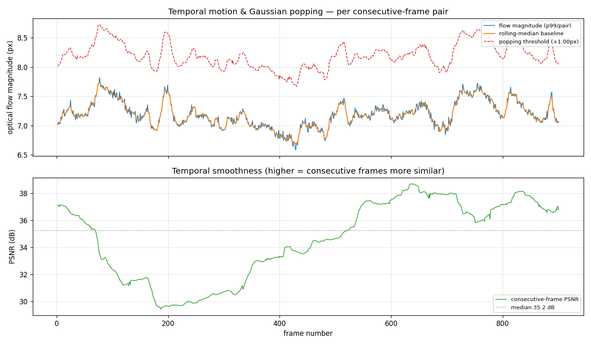

<em>Temporal-consistency report for a 900-frame fly-through of the RoboScene+ Gaussian Splat — flow magnitude (top) hugs its baseline and never crosses the popping threshold; PSNR (bottom) stays smooth. Verdict: a clean, popping-free render.</em>

</div>

&nbsp;

## Overview

A **temporal consistency and quality evaluator** for Gaussian Splat render sequences. You feed it a folder of rendered fly-through frames; it tells you whether a *smoothly moving camera* produced *smoothly changing renders*, or whether Gaussians **"pop"** in and out at visibility boundaries — a known 3D Gaussian Splatting artifact.

It is **inference-only** (no training), runs on **CPU or GPU**, and is **reproducible** — the same frames always yield the same numbers. The splat and the rendered frames in this project come from the companion repository [**3D-Spatial-Reconstruction**](https://github.com/JesonRamesh/3D-Spatial-Reconstruction).

The tool computes three signals per consecutive frame pair:

| Metric | What it measures | Why it matters |
|---|---|---|
| **PSNR** | How similar each frame is to the previous one | A global temporal-smoothness proxy |
| **Optical flow magnitude (RAFT)** | Dense per-pixel apparent motion between frames | Localises *where* and *how coherently* the image changed |
| **Popping detector** | Impulsive spikes in flow magnitude vs a smooth baseline | Flags Gaussians appearing/disappearing under smooth camera motion |

&nbsp;

## What Gaussian popping is

When a camera moves through a splat, Gaussians near the visibility boundary appear and disappear suddenly between frames. This shows up as a **localised spike in optical flow magnitude** even though the camera moved smoothly. In a flow-magnitude time series it is an **impulsive outlier sitting on top of the smooth baseline** set by ordinary camera motion — so the detector below is an outlier finder on that series, *not* a fixed-threshold alarm.

&nbsp;

## Pipeline

```
frames/*.png ──▶ flow.py ──▶ metrics.py ──▶ pipeline.py ──▶ report.py ──▶ results/
                 (RAFT)      (PSNR, flow      (orchestrate,    (plots +
                              magnitude,       enforce          summary)
                              popping)         consecutive
                                               pairing)
```

### Architecture

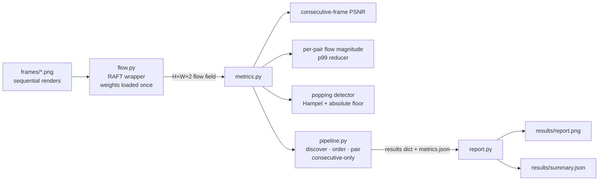

Each `src/` module does **one thing** and is testable independently. Two facts live only in `pipeline.py`: the frame ordering, and the rule that **only adjacent frames may be paired** — `flow.py` and `metrics.py` are deliberately ignorant of sequence order.

&nbsp;

## Quick Start

**No GPU required** — RAFT runs inference-only and falls back to CPU automatically.

```bash
git clone https://github.com/JesonRamesh/Gaussian-Splat-Evaluator.git
cd Gaussian-Splat-Evaluator
pip install -r requirements.txt

# place your rendered fly-through frames in frames/ (e.g. 000001.png, 000002.png, ...)
python -m src.pipeline --frames frames --out results
```

Outputs land in `results/`: `report.png` (the figure above), `summary.json` (headline numbers), and `metrics.json` (full per-frame data).

&nbsp;

## Running the Evaluator

Run from the repo root via the module entry point:

```bash
python -m src.pipeline --frames frames --out results --reduce p99 --pop-k 4.0 --pop-min-abs 1.0
```

All paths and thresholds are configurable — nothing is hardcoded:

| Flag | Default | Description |
|---|---|---|
| `--frames` | *(required)* | Folder of sequential rendered frames |
| `--out` | `results` | Output folder for `report.png` / `*.json` |
| `--reduce` | `p99` | Per-pair magnitude reducer: `mean` \| `max` \| `p<N>` |
| `--pop-window` | `5` | Rolling-median window for the popping baseline |
| `--pop-k` | `4.0` | Popping sensitivity (lower = more sensitive) |
| `--pop-min-abs` | `1.0` | Absolute flow floor (px) a pop must clear |
| `--device` | auto | Force `cpu` or `cuda` |
| `--limit` | none | Process only the first N frames (quick test) |

Run the metric sanity checks:

```bash
python -m pytest tests/test_metrics.py -q
```

&nbsp;

## Results

Two scenes have been evaluated: a static real-world reconstruction and a dynamic synthetic animation.

---

### RoboScene+ — static fly-through (900 frames, CPU)

Evaluated on a **900-frame** constant-speed fly-through of the RoboScene+ splat (899 consecutive pairs, ~21 min on CPU).

| Metric | Value |
|---|---|
| Frames / pairs | 900 / 899 |
| Flow magnitude (p99/pair) | median **7.18 px** · max 7.82 px |
| Frame-to-frame change | **0.05 px** (extremely smooth) |
| PSNR | median **35.2 dB** · min 29.4 dB |
| **Popping events** | **0** |
| Verdict | *Clean, popping-free render at this spatial scale* |

The **headline figure at the top** makes the negative result *legible*: the flow line (blue) sits directly on its rolling-median baseline (orange) and never approaches the red popping threshold — there is no high-frequency spike structure, which is the fingerprint of popping. The PSNR dip near frame ~180 is **not** an artifact: the top panel shows no matching flow spike there, so it reflects busier scene geometry, not popping (a real pop would show in *both* panels at once).

<div align="center">
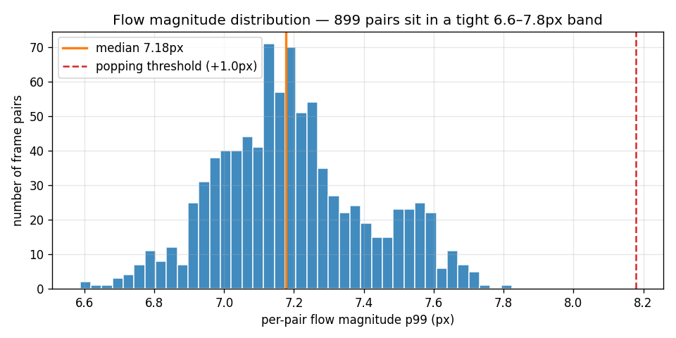
<br><sub><em>All 899 pairs fall in a tight 6.6–7.8 px band, far below the +1.0 px popping threshold.</em></sub>
</div>

#### Capture quality matters

The metric only works when consecutive frames are *near-identical* — a slow, smooth camera path. An initial **hand-recorded** capture moved the camera too fast and unevenly, drowning popping under genuine parallax. Re-recording at **constant slow speed** collapsed the baseline and removed every phantom detection:

<div align="center">
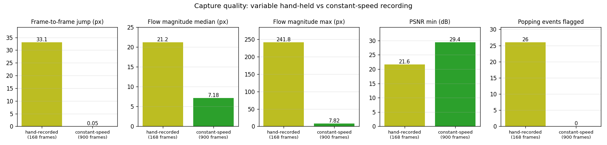
<br><sub><em>Variable hand-held capture vs constant-speed capture across five quality indicators (real numbers from both runs).</em></sub>
</div>

---

### D-NeRF bouncingballs — dynamic scene, time interpolation (150 frames, GPU)

Evaluated on **150 frames** rendered by [Deformable-3D-Gaussians](https://github.com/ingra14m/Deformable-3D-Gaussians) trained on the [D-NeRF](https://github.com/albertpumarola/D-NeRF) `bouncingballs` scene (149 pairs, 11.5 s on RTX 4070 Ti Super). The rendering mode fixes the camera and interpolates time across the full animation cycle — so consecutive frames differ only due to scene dynamics, not camera motion.

| Metric | Value |
|---|---|
| Frames / pairs | 150 / 149 |
| Flow magnitude (p99/pair) | median **4.12 px** · max 5.80 px |
| Frame-to-frame change | **0.46 px** |
| PSNR | mean **39.11 dB** · min 33.60 dB |
| **Popping events** | **0** |
| Verdict | *0 popping event(s) detected at this spatial scale; baseline flow 4.12 px* |

<div align="center">

| t = 0 | t = 0.20 | t = 0.40 | t = 0.60 | t = 0.80 | t = 1.0 |
|:---:|:---:|:---:|:---:|:---:|:---:|
| 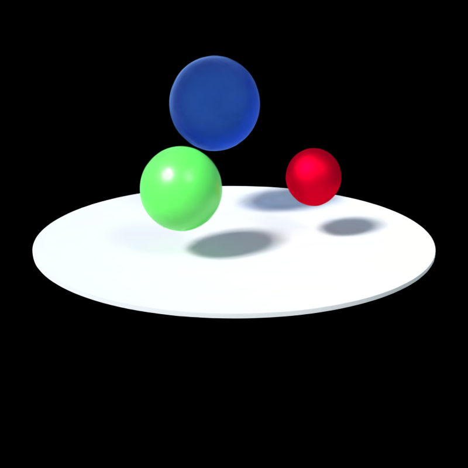 | 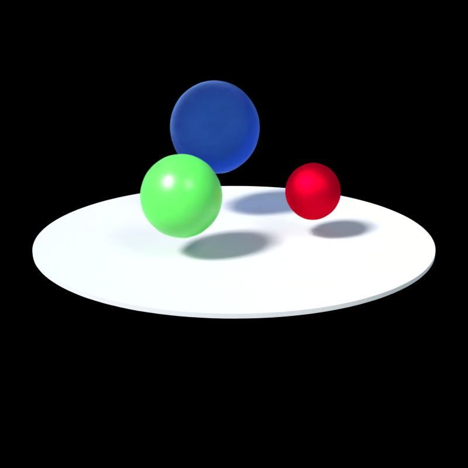 | 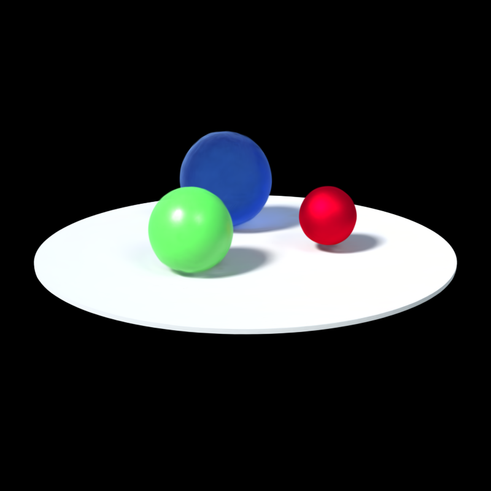 | 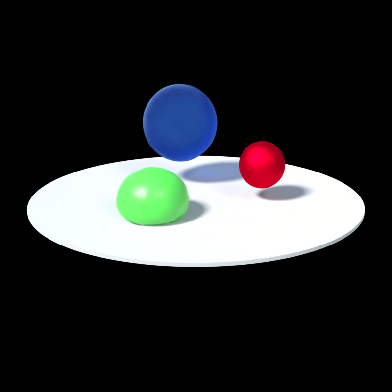 | 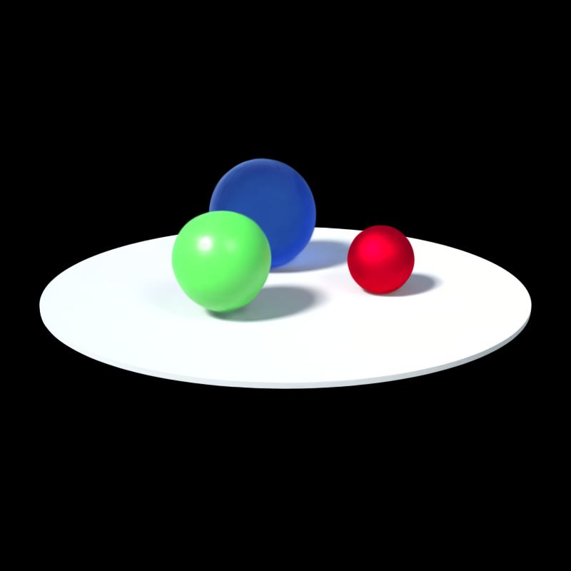 | 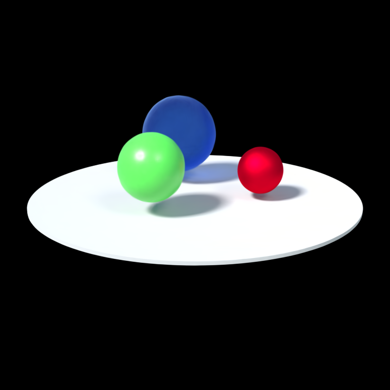 |

<sub><em>Six evenly spaced frames across the full animation cycle — balls rise, reach peak separation, fall back to the platform, and return to rest. These are rendered by Deformable-3DGS from a fixed camera viewpoint.</em></sub>

</div>

<div align="center">
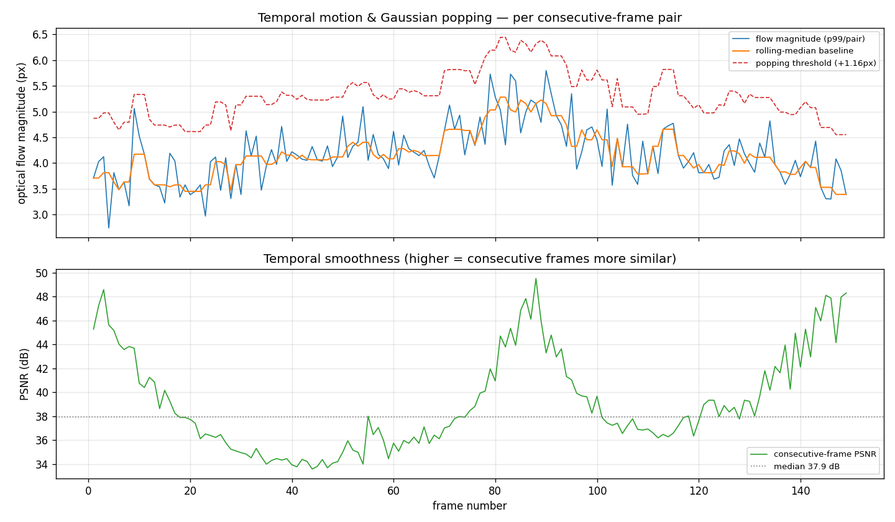
<br><sub><em>Temporal-consistency report for 150 time-interpolated frames of the D-NeRF bouncingballs scene. Flow (blue) tracks smoothly under the baseline (orange) and never reaches the popping threshold (dashed red). The PSNR U-shape reflects ball physics — frames are most similar at rest and least similar at peak velocity (~frames 40–65) — not rendering artifacts.</em></sub>
</div>

The lower PSNR trough (~33–34 dB at mid-sequence) co-occurs with *higher* flow magnitude, which is consistent with real scene dynamics: the balls move fastest at mid-arc, so consecutive frames naturally diverge more. Critically, there is no impulsive spike in the flow panel — the variation is gradual and physics-driven, not a rendering discontinuity. A genuine popping event would produce a sharp isolated spike in the flow panel with no corresponding smooth ramp-up.

&nbsp;

## Tech Stack

| Component | Tool |
|---|---|
| Optical flow | RAFT (`torchvision.models.optical_flow.raft_large`, pretrained) |
| Frame I/O | OpenCV (BGR→RGB handled at the boundary) |
| Metrics | NumPy (PSNR, flow magnitude, Hampel popping detector) |
| Plots & report | matplotlib (Agg, headless) |
| Tests | pytest |

&nbsp;

## Design Choices

| Choice | Rationale (and the alternative rejected) |
|---|---|
| **RAFT weights loaded once** in a class | Avoids reloading per frame pair. *Alt: lazy module singleton — less explicit lifetime.* |
| **Pad to /8, never resize** | RAFT needs ÷8 dimensions; resizing would rescale flow magnitudes and break reproducibility. |
| **p99 reducer**, not mean | Popping is *localised*; a frame-wide mean dilutes it, a raw max is single-pixel noise. p99 is the sensitive-but-robust middle. |
| **Rolling median baseline**, not moving average | The median ignores the very spikes we hunt; a mean gets pulled up by them and masks the event. |
| **Hampel detector + absolute floor** | Detrend so fast-but-smooth camera sections don't fire; MAD so spikes can't inflate their own threshold; an absolute floor so a *clean* baseline (tiny σ) doesn't flag sub-pixel noise as popping. |
| **Consecutive-only pairing in `pipeline.py`** | Lower modules stay order-agnostic; the adjacency rule lives in exactly one place. |

&nbsp;

## Limitations

- **p99 sensitivity ceiling** — a *very small* localised pop (a few thousand of ~921k pixels) barely moves the 99th percentile, so the tool reliably catches medium-to-large pops but could miss tiny ones. The verdict is therefore "0 pops *at this spatial scale*", not a mathematical guarantee.
- **Capture-dependent** — results are only meaningful when consecutive frames are near-identical (slow, constant-speed, densely sampled camera path). Fast or uneven capture conflates parallax with popping.
- **CPU runtime** — ~1.4 s/pair on CPU (~21 min for 900 frames); a GPU cuts this substantially.

&nbsp;

## Future Work

- **Motion-compensated / coherence-based popping** — compare observed flow against the smooth expected camera flow, so popping can be isolated even under faster motion.
- **Per-region heatmaps** — surface the `(H,W)` magnitude map in the report to show *where* a pop occurred, not just when.
- **Scripted camera paths** — render frames at a fixed parametric step for perfectly constant speed and exact reproducibility.

&nbsp;

## References

1. Teed & Deng, *RAFT: Recurrent All-Pairs Field Transforms for Optical Flow*, ECCV 2020 — [arXiv:2003.12039](https://arxiv.org/abs/2003.12039)
2. Kerbl et al., *3D Gaussian Splatting for Real-Time Radiance Field Rendering*, SIGGRAPH 2023 — [project page](https://repo-sam.inria.fr/fungraph/3d-gaussian-splatting/)
3. Yang et al., *Deformable 3D Gaussians for High-Fidelity Monocular Dynamic Scene Reconstruction*, CVPR 2024 — [GitHub](https://github.com/ingra14m/Deformable-3D-Gaussians)
4. Pumarola et al., *D-NeRF: Neural Radiance Fields for Dynamic Scenes*, CVPR 2021 — [GitHub](https://github.com/albertpumarola/D-NeRF)
5. Companion data source — [3D-Spatial-Reconstruction](https://github.com/JesonRamesh/3D-Spatial-Reconstruction)

&nbsp;

## Author

**Jeson Ramesh** — [GitHub](https://github.com/JesonRamesh) · University College London

<sub>Built as a temporal-quality companion to the RoboScene+ Gaussian Splat reconstruction.</sub>
